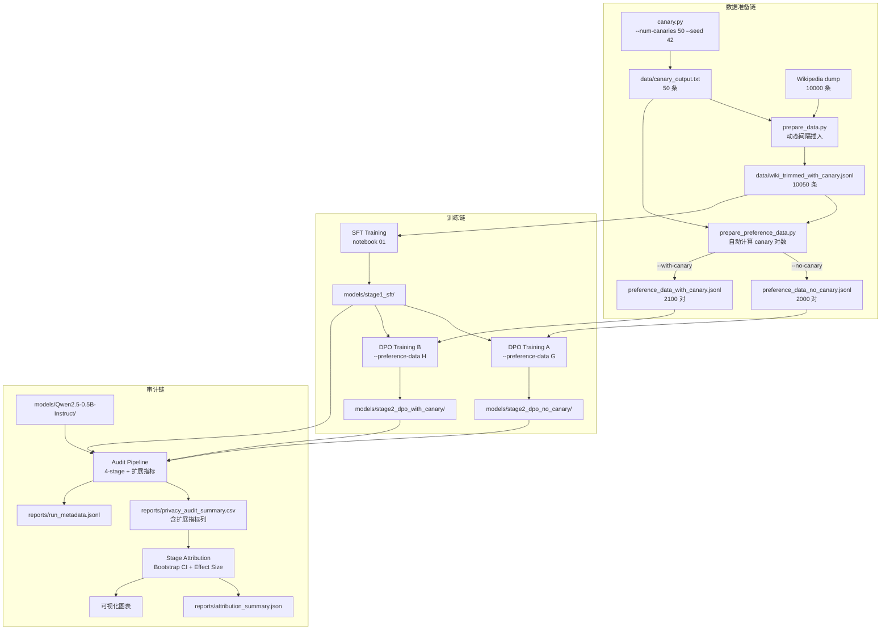

# 设计文档：Canary Scale-Up（10→50）

## 概述

本设计将 canary 样本从 10 扩充到 50，涉及全链路改动：canary 生成参数化、数据插入策略重构、偏好数据自动调整、审计指标扩展（序列级提取、Top-k 命中率、ROC_AUC/PR_AUC）、统计置信度改进（Bootstrap CI、Effect Size、多 seed 支持）、运行元数据落盘。

设计原则：
- 最小改动：在现有模块上扩展，不重写
- 参数化优先：消除所有硬编码常量，通过 CLI 参数或自动计算替代
- 向后兼容：保留现有 CSV 核心列和 MIA_Gap（标注 deprecated，计划在完成多 seed 验证且所有下游工具迁移到 ROC_AUC 后移除），新增列追加在后
- 间距基线：canary 分布均匀性基于 wiki-only 长度计算（`interval = len(wiki) // num_canaries`），合并后的总长度仅用于日志输出
- 元数据格式：`reports/run_metadata.jsonl` 使用 JSONL 格式（每行一个 JSON 对象），每次运行追加一行，避免并发写入的 lost-update 风险；读取时逐行解析
- 指标命名约定：所有指标名统一使用下划线格式（`ROC_AUC`、`PR_AUC`、`MIA_Gap`、`Top5_Hit_Rate` 等），在 CSV 列名、JSON key、代码变量中保持一致

## 架构



### 数据流概览

```
canary.py (50条) → prepare_data.py (均匀插入) → prepare_preference_data.py (100对)
                                                          ↓
                                              SFT → DPO×2 → Audit×4 → Attribution
```

## 组件与接口

### 1. Canary_Generator (`src/canary.py`)

改动：添加 argparse CLI，参数化 `--num-canaries` 和 `--seed`。

```python
def parse_args(argv=None):
    parser = argparse.ArgumentParser(description="Generate canary samples")
    parser.add_argument("--num-canaries", type=int, default=50,
                        help="Number of canary samples to generate (default: 50)")
    parser.add_argument("--seed", type=int, default=42,
                        help="Random seed for reproducibility")
    parser.add_argument("--output", type=str, default="data/canary_output.txt",
                        help="Output file path")
    return parser.parse_args(argv)
```

`__main__` 改为使用 `parse_args()` 驱动，移除硬编码 `10`。`--num-canaries < 1` 时打印错误并 `sys.exit(1)`。

### 2. Data_Preparer (`src/prepare_data.py`)

改动：移除 `INTERVAL=900`，改为动态计算；添加占比检查和分布验证。

```python
def compute_insertion_positions(num_wiki: int, num_canaries: int) -> List[int]:
    """
    计算 canary 插入位置，确保均匀分布。
    
    间隔基线：interval = num_wiki // num_canaries
    第 i 个 canary 插入在 wiki 位置 i * interval 之前。
    
    分布约束：
    - max_gap <= 2 * avg_gap
    - min_gap >= 0.5 * avg_gap
    """
    if num_canaries == 0:
        return []
    interval = num_wiki // num_canaries
    positions = [i * interval for i in range(num_canaries)]
    return positions

def validate_distribution(positions: List[int], num_wiki: int) -> bool:
    """验证 canary 分布满足间距约束。"""
    if len(positions) <= 1:
        return True
    gaps = [positions[i+1] - positions[i] for i in range(len(positions)-1)]
    # 末尾 gap 到数据结尾
    gaps.append(num_wiki - positions[-1])
    avg_gap = num_wiki / len(positions)
    return all(g <= 2 * avg_gap and g >= 0.5 * avg_gap for g in gaps)
```

占比检查逻辑：
- `ratio > 0.008` (0.8%) → 警告
- `ratio > 0.01` (1%) → 错误退出

日志输出示例：
```
[INFO] Canary: 50, Wiki: 10000, Total: 10050, Ratio: 0.50%
```

### 3. Preference_Data_Generator (`src/prepare_preference_data.py`)

改动：移除 `NUM_CANARY_PAIRS = 20`，改为自动计算。

```python
PAIRS_PER_CANARY = 2  # 每个 canary 生成 2 个偏好对

def compute_num_canary_pairs(canaries: List[str]) -> int:
    """根据 canary 数量自动计算偏好对数。"""
    return len(canaries) * PAIRS_PER_CANARY
```

`generate_preference_data()` 签名中 `num_canary_pairs` 参数改为可选，默认 `None` 时自动计算。

### 4. 审计指标扩展模块

#### 4a. 序列级提取成功率 (`src/audit/extraction.py` 扩展)

复用现有 `canary_extraction_test()` 函数，已实现 greedy decode + 匹配。新增聚合函数：

```python
def compute_extraction_rate(model, tokenizer, canaries: List[str]) -> float:
    """计算序列级提取成功率。"""
    results = canary_extraction_test(model, tokenizer, canaries)
    return sum(r["extracted"] for r in results) / len(results)
```

#### 4b. Token 级 Top-k 命中率 (`src/audit/extraction.py` 扩展)

```python
@torch.no_grad()
def topk_hit_rate(model, tokenizer, text: str, k: int) -> float:
    """
    计算单条 canary 的 token 级 Top-k 命中率。
    对 canary 中每个 token（除第一个），检查模型在该位置的 top-k 预测是否包含该 token。
    返回命中比例。
    """
    inputs = tokenizer(text, return_tensors="pt").to(model.device)
    outputs = model(**inputs)
    logits = outputs.logits[0, :-1, :]  # (seq_len-1, vocab)
    target_ids = inputs["input_ids"][0, 1:]  # (seq_len-1,)
    
    topk_ids = torch.topk(logits, k, dim=-1).indices  # (seq_len-1, k)
    hits = (topk_ids == target_ids.unsqueeze(-1)).any(dim=-1)  # (seq_len-1,)
    return hits.float().mean().item()

def compute_topk_hit_rates(model, tokenizer, canaries: List[str], 
                           ks: List[int] = [5, 10, 50]) -> Dict[str, float]:
    """计算多个 k 值的平均 Top-k 命中率。"""
    results = {}
    for k in ks:
        rates = [topk_hit_rate(model, tokenizer, c, k) for c in canaries]
        results[f"Top{k}_Hit_Rate"] = sum(rates) / len(rates)
    return results
```

#### 4c. ROC_AUC / PR_AUC (`src/audit/mia.py` 扩展)

```python
from sklearn.metrics import roc_auc_score, average_precision_score

def compute_auc_metrics(member_losses: List[float], 
                        non_member_losses: List[float]) -> Dict[str, float]:
    """
    计算 ROC_AUC 和 PR_AUC。
    正例 = canary (member)，负例 = 等量随机 non-canary。
    """
    scores = member_losses + non_member_losses
    labels = [1] * len(member_losses) + [0] * len(non_member_losses)
    return {
        "ROC_AUC": roc_auc_score(labels, scores),
        "PR_AUC": average_precision_score(labels, scores),
    }
```

保留现有 `loss_based_mia()` 返回的 `member_mean - non_member_mean` 作为 MIA_Gap（deprecated）。

### 5. Bootstrap CI + Effect Size (`src/stage_attribution.py` 扩展)

```python
import numpy as np

EXTENDED_METRICS = [
    "MIA_Gap", "Avg_LogProb", "Avg_Rank", "Canary_PPL", "PPL_Ratio",
    "Extraction_Rate", "Top5_Hit_Rate", "Top10_Hit_Rate", "Top50_Hit_Rate",
    "ROC_AUC", "PR_AUC",
]

def bootstrap_ci(data_a: np.ndarray, data_b: np.ndarray, 
                 n_bootstrap: int = 10000, ci: float = 0.95) -> Dict:
    """
    计算两组数据差值的 Bootstrap 置信区间。
    用于 per-canary 级别的指标比较（Stage2b vs Stage2a）。
    """
    diffs = data_b - data_a
    boot_means = [np.mean(np.random.choice(diffs, size=len(diffs), replace=True))
                  for _ in range(n_bootstrap)]
    alpha = (1 - ci) / 2
    lower = np.percentile(boot_means, alpha * 100)
    upper = np.percentile(boot_means, (1 - alpha) * 100)
    return {
        "mean_diff": float(np.mean(diffs)),
        "ci_lower": float(lower),
        "ci_upper": float(upper),
        "crosses_zero": bool(lower <= 0 <= upper),
    }

def cohens_d(data_a: np.ndarray, data_b: np.ndarray) -> float:
    """计算 Cohen's d 效应量。"""
    diff = np.mean(data_b) - np.mean(data_a)
    pooled_std = np.sqrt((np.var(data_a) + np.var(data_b)) / 2)
    return float(diff / pooled_std) if pooled_std > 0 else 0.0
```

### 6. 运行元数据 (`src/run_metadata.py` 新增)

```python
import json
import subprocess
from datetime import datetime
from pathlib import Path

METADATA_PATH = "reports/run_metadata.jsonl"

def get_git_commit() -> str:
    try:
        return subprocess.check_output(
            ["git", "rev-parse", "HEAD"], text=True
        ).strip()
    except Exception:
        return "unknown"

def append_metadata(entry: dict, path: str = METADATA_PATH):
    """追加一条运行元数据到 JSONL 文件（每行一个 JSON 对象）。"""
    p = Path(path)
    p.parent.mkdir(parents=True, exist_ok=True)
    entry["timestamp"] = datetime.utcnow().isoformat() + "Z"
    entry["commit"] = get_git_commit()
    with open(p, "a") as f:
        f.write(json.dumps(entry, ensure_ascii=False) + "\n")

def load_metadata(path: str = METADATA_PATH) -> list:
    """读取所有运行元数据。"""
    p = Path(path)
    if not p.exists():
        return []
    entries = []
    with open(p) as f:
        for line in f:
            line = line.strip()
            if line:
                try:
                    entries.append(json.loads(line))
                except json.JSONDecodeError:
                    continue  # skip corrupted lines
    return entries
```

训练脚本调用示例（超参数值仅为示意，实际以代码中的默认值为准）：
```python
append_metadata({
    "type": "dpo_training",
    "seed": args.seed,
    "model_path": args.output_dir,
    "preference_data": args.preference_data,
})
```

### 7. 预定义判定标准

在 `src/stage_attribution.py` 中新增：

```python
DECISION_CRITERIA = {
    "direction_consistency_threshold": 0.7,  # 方向一致率 >= 70%
    "ci_significance": "ci_does_not_cross_zero",
    "effect_size_threshold": 0.2,  # |Cohen's d| >= 0.2 (small effect)
}

def evaluate_criteria(ci_result: dict, effect_size: float) -> dict:
    """评估单个指标是否满足预定义判定标准。"""
    return {
        "statistically_significant": not ci_result["crosses_zero"],
        "practically_significant": abs(effect_size) >= DECISION_CRITERIA["effect_size_threshold"],
        "effect_size_category": (
            "large" if abs(effect_size) >= 0.8 else
            "medium" if abs(effect_size) >= 0.5 else
            "small" if abs(effect_size) >= 0.2 else
            "negligible"
        ),
    }
```

## 数据模型

### 审计结果 CSV 格式（扩展后）

```csv
Stage,MIA_Gap,Avg_LogProb,Avg_Rank,Canary_PPL,PPL_Ratio,Extraction_Rate,Top5_Hit_Rate,Top10_Hit_Rate,Top50_Hit_Rate,ROC_AUC,PR_AUC
Stage0_Base,...,...,...,...,...,...,...,...,...,...,...
Stage1_SFT,...,...,...,...,...,...,...,...,...,...,...
Stage2a_DPO_NoCanary,...,...,...,...,...,...,...,...,...,...,...
Stage2b_DPO_WithCanary,...,...,...,...,...,...,...,...,...,...,...
```

前 6 列为现有核心列（保持向后兼容），后 6 列为新增扩展列。

### 运行元数据 JSONL 格式

`reports/run_metadata.jsonl`，每行一个 JSON 对象：

```jsonl
{"type": "sft_training", "seed": 42, "model_path": "models/stage1_sft", "timestamp": "2026-02-18T12:00:00Z", "commit": "abc1234", "hyperparams": {"lr": "...", "epochs": 3}}
{"type": "dpo_training", "seed": 42, "model_path": "models/stage2_dpo_no_canary", "preference_data": "data/preference_data_no_canary.jsonl", "timestamp": "2026-02-18T13:00:00Z", "commit": "abc1234", "hyperparams": {"lr": "...", "epochs": 1, "beta": 0.1}}
{"type": "audit", "seed": 42, "canary_count": 50, "canary_ratio": 0.005, "model_paths": ["models/Qwen2.5-0.5B-Instruct", "models/stage1_sft", "models/stage2_dpo_no_canary", "models/stage2_dpo_with_canary"], "timestamp": "2026-02-18T14:00:00Z", "commit": "abc1234"}
```

超参数值（如 `lr`）以实际代码默认值为准，此处省略具体数值。

### 归因报告 JSON 格式（扩展后）

在现有 `attribution_summary.json` 基础上新增：

```json
{
  "statistical_analysis": {
    "MIA_Gap": {
      "bootstrap_ci": {"mean_diff": -0.15, "ci_lower": -0.28, "ci_upper": -0.03, "crosses_zero": false},
      "cohens_d": -0.42,
      "criteria_met": {"statistically_significant": true, "practically_significant": true, "effect_size_category": "small"}
    },
    ...
  },
  "decision_criteria": {
    "direction_consistency_threshold": 0.7,
    "effect_size_threshold": 0.2
  }
}
```


## 正确性属性

*正确性属性是系统在所有有效执行中都应保持为真的特征或行为——本质上是关于系统应该做什么的形式化陈述。属性是人类可读规范与机器可验证正确性保证之间的桥梁。*

### Property 1: Canary 生成数量与文件一致性

*For any* 正整数 N（1 ≤ N ≤ 500），调用 `generate_canary_batch(N)` 应返回恰好 N 条 canary；将其写入文件后读回，文件应恰好包含 N 行非空内容。

**Validates: Requirements 1.1, 1.3**

### Property 2: Canary 生成种子确定性

*For any* 种子值 S 和正整数 N，使用相同的 S 和 N 两次调用 `generate_canary_batch` 应产生完全相同的 canary 序列。

**Validates: Requirements 1.4, 10.2**

### Property 3: Canary 插入分布均匀性

*For any* wiki 语料列表（长度 100-20000）和 canary 列表（长度 1-200，且占比 < 1%），插入后相邻 canary 之间的最大间距不超过平均间距的 2 倍，最小间距不低于平均间距的 0.5 倍。

**Validates: Requirements 2.1, 2.2, 2.8, 10.1**

### Property 4: Canary 偏好对数量与覆盖

*For any* canary 列表（长度 1-100），生成的 canary 偏好对总数应恰好为 `2 * len(canaries)`，且每个 canary 至少出现在 2 个偏好对中。

**Validates: Requirements 3.1, 3.3**

### Property 5: 偏好数据变体等价性

*For any* 有效的 wiki 文本集合和 canary 列表，分别以 `include_canary=False` 和 `include_canary=True` 生成偏好数据后，从 with-canary 变体中移除 canary 对，剩余的普通偏好对应与 no-canary 变体逐行完全相同。

**Validates: Requirements 3.4, 10.5**

### Property 6: 数据准备种子确定性

*For any* 种子值 S、wiki 语料和 canary 列表，使用相同的 S 两次执行数据准备流程应产生完全相同的输出文件内容。

**Validates: Requirements 10.3**

### Property 7: AUC 指标有效性

*For any* 非空的 member_losses 和 non_member_losses 列表（长度相等，至少各 2 个元素），计算得到的 ROC_AUC 和 PR_AUC 应在 [0, 1] 范围内。

**Validates: Requirements 6.3**

### Property 8: 扩展 CSV 与归因兼容性

*For any* 包含四阶段审计结果的 DataFrame（含所有 11 个指标列），输出的 CSV 应包含所有预期列（核心列 + 扩展列），且 Stage_Attribution_Analyzer 应能正确读取并对所有指标列计算 delta 值。

**Validates: Requirements 6.5, 6.7**

### Property 9: Bootstrap CI 正确性

*For any* 两组等长数值数组（长度 ≥ 5），Bootstrap CI 应满足 `ci_lower ≤ mean_diff ≤ ci_upper`；当两组数据完全相同时，`crosses_zero` 应为 True。

**Validates: Requirements 7.1, 7.3**

### Property 10: Cohen's d 正确性

*For any* 两组等长数值数组，当两组数据完全相同时 Cohen's d 应为 0；当 data_b 的均值大于 data_a 时 Cohen's d 应为正值。

**Validates: Requirements 7.2**

### Property 11: 元数据追加一致性

*For any* 元数据 entry 序列（长度 1-20），依次追加到 `run_metadata.jsonl` 后，读回的 entry 列表应包含所有 entry 且顺序一致，每个 entry 应包含 `timestamp` 和 `commit` 字段。

**Validates: Requirements 8.1, 8.2, 8.3**

### Property 12: 判定标准评估正确性

*For any* Bootstrap CI 结果和 Effect Size 值，当 CI 不跨零时 `statistically_significant` 应为 True；当 `|effect_size| >= 0.2` 时 `practically_significant` 应为 True；effect_size_category 应与 Cohen's d 阈值一致（negligible < 0.2 ≤ small < 0.5 ≤ medium < 0.8 ≤ large）。

**Validates: Requirements 8.5**

## 错误处理

| 模块 | 错误场景 | 处理方式 |
|------|---------|---------|
| canary.py | `--num-canaries < 1` | 输出错误信息，`sys.exit(1)` |
| prepare_data.py | canary 占比 > 1% | 输出错误信息，`sys.exit(1)` |
| prepare_data.py | canary 占比 > 0.8% 且 ≤ 1% | 输出警告，继续执行 |
| prepare_data.py | canary 文件缺失或为空 | 输出错误信息，`sys.exit(1)` |
| prepare_preference_data.py | canary 列表为空（with-canary 模式） | 输出错误信息，`sys.exit(1)` |
| stage_attribution.py | CSV 缺少预期 Stage 行（严格模式） | 输出错误信息，`sys.exit(1)` |
| stage_attribution.py | CSV 缺少预期 Stage 行（宽松模式） | 输出警告，跳过缺失阶段 |
| stage_attribution.py | Stage2a 和 Stage2b 所有指标完全相等 | 输出警告（sanity check） |
| run_metadata.py | `run_metadata.jsonl` 不存在 | 追加写入时自动创建 |
| run_metadata.py | `run_metadata.jsonl` 某行格式损坏 | 读取时跳过损坏行，继续解析后续行 |
| audit (ROC_AUC) | member 或 non-member 样本不足 | 输出警告，跳过 AUC 计算，填充 NaN |

## 测试策略

### 测试框架

- 单元测试：`pytest`
- Property-based 测试：`hypothesis`（Python 生态中最成熟的 PBT 库）
- 每个 property test 最少运行 100 次迭代
- 依赖：`hypothesis` 和 `scikit-learn` 需添加到 `requirements.txt`

### Property-Based 测试

每个正确性属性对应一个 property-based test，使用 `hypothesis` 生成随机输入：

| Property | 生成器策略 |
|----------|-----------|
| P1 (生成数量) | `st.integers(1, 500)` 生成 N |
| P2 (种子确定性) | `st.integers(0, 2**32-1)` 生成 seed，`st.integers(1, 100)` 生成 N |
| P3 (分布均匀性) | `st.integers(100, 5000)` 生成 wiki 长度，`st.integers(1, 50)` 生成 canary 数（约束占比 < 1%） |
| P4 (偏好对数量) | `st.lists(st.text(min_size=5), min_size=1, max_size=50)` 生成 canary 列表 |
| P5 (变体等价性) | 随机生成 wiki 文本列表和 canary 列表 |
| P6 (插入确定性) | `st.integers(0, 2**32-1)` 生成 seed |
| P7 (AUC 有效性) | `st.lists(st.floats(-10, 0), min_size=2, max_size=50)` 生成 loss 列表 |
| P8 (CSV 兼容性) | 随机生成四阶段 DataFrame（11 个指标列） |
| P9 (Bootstrap CI) | `st.lists(st.floats(-100, 100), min_size=5, max_size=50)` 生成两组数据 |
| P10 (Cohen's d) | 同 P9 |
| P11 (元数据追加) | `st.lists(st.dictionaries(st.text(), st.text()), min_size=1, max_size=10)` |
| P12 (判定标准) | 随机生成 CI 结果和 effect size |

每个 test 必须包含注释引用设计文档中的 property 编号：
```python
# Feature: canary-scale-up, Property 1: Canary generation count + file round-trip
```

### 单元测试

单元测试覆盖具体示例和边界情况：

- CLI 参数解析：`--num-canaries`、`--seed`、无参数默认值、无效值
- 占比阈值：0.8% 警告、1% 硬失败
- Stage2a/Stage2b 全相等 sanity check
- 元数据必填字段验证
- 错误处理路径（缺失文件、空文件、无效输入）

### 测试不覆盖的范围

以下需求依赖 Colab GPU 环境，不在自动化测试范围内：
- 实际模型训练（需求 4.1-4.5）
- 模型推理和审计执行（需求 5.1-5.4, 6.1-6.2）
- Notebook 执行
- 文档内容验证（需求 9.1-9.5）
