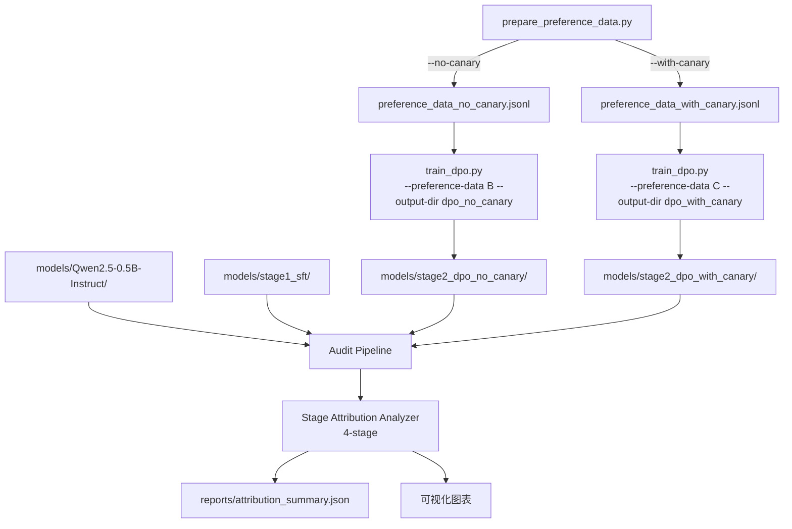

# 设计文档：DPO Canary 消融实验

## 概述

本设计将现有的单一 DPO 训练流程拆分为两个实验组（DPO-no-canary 和 DPO-with-canary），通过最小化的代码改动实现消融实验。核心思路是：在偏好数据生成阶段引入 CLI 标志控制 canary 对的包含与否，在训练阶段参数化数据路径和输出目录，在审计和归因阶段扩展为四阶段分析。

设计原则：
- 最小改动：复用现有模块，仅扩展必要的参数化接口
- 数据一致性：通过固定随机种子确保两个变体的普通偏好对完全相同
- 向后兼容：偏好数据生成的默认行为（无标志时生成两个变体）不破坏现有工作流；DPO 训练 CLI 采用严格模式（`required=True`），不保留旧的无参数用法

## 架构



### 四阶段流水线

```
Stage0_Base ──────────────────────────────────────────────┐
Stage1_SFT ───────────────────────────────────────────────┤
Stage2a_DPO_NoCanary (SFT + 偏好数据无 canary) ──────────┤──▶ Audit ──▶ Attribution
Stage2b_DPO_WithCanary (SFT + 偏好数据含 canary) ────────┘
```

## 组件与接口

### 1. Preference_Data_Generator (`src/prepare_preference_data.py`)

改动：添加 `argparse` CLI 接口，将 canary 注入逻辑条件化。

```python
# CLI 接口
def parse_args():
    parser = argparse.ArgumentParser()
    parser.add_argument("--no-canary", action="store_true",
                        help="Generate preference data without canary pairs")
    parser.add_argument("--with-canary", action="store_true",
                        help="Generate preference data with canary pairs")
    parser.add_argument("--seed", type=int, default=42,
                        help="Random seed for reproducibility")
    return parser.parse_args()

# 核心生成函数签名
def generate_preference_data(
    wiki_texts: List[str],
    canaries: List[str],
    include_canary: bool,
    seed: int = 42,
    num_normal_pairs: int = 2000,
    num_canary_pairs: int = 20
) -> List[dict]:
    """Generate preference pairs with deterministic normal pairs."""
    ...
```

模式逻辑：
- `--no-canary` → 生成 `data/preference_data_no_canary.jsonl`（仅普通对）
- `--with-canary` → 生成 `data/preference_data_with_canary.jsonl`（普通对 + canary 对）
- 无标志 → 生成两个文件
- 两个标志同时指定 → 报错退出

关键实现细节：先用固定种子生成普通偏好对列表，保存为基础数据。no-canary 变体直接输出基础数据（保持种子确定的顺序）；with-canary 变体在基础数据末尾追加 canary 对，不对普通对重新 shuffle。这确保移除 canary 对后两个变体的普通偏好对逐行完全一致。

### 2. DPO_Trainer (`src/train_dpo.py`)

改动：添加 `argparse` CLI 接口，参数化数据路径和输出目录。

```python
def parse_args():
    parser = argparse.ArgumentParser()
    parser.add_argument("--preference-data", type=str, required=True,
                        help="Path to preference data file (required)")
    parser.add_argument("--output-dir", type=str, required=True,
                        help="Output directory for trained model (required)")
    parser.add_argument("--sft-model", type=str,
                        default="models/stage1_sft",
                        help="Path to SFT model")
    parser.add_argument("--base-model", type=str,
                        default="models/Qwen2.5-0.5B-Instruct",
                        help="Path to base model")
    return parser.parse_args()
```

训练超参数保持硬编码不变（两个变体必须使用相同超参数）。采用严格 CLI 模式（Option A）：`--preference-data` 和 `--output-dir` 为必填参数，不提供默认值。这意味着不再支持无参数直接运行 `python src/train_dpo.py` 的旧用法（该场景已完成，现有模型在 `models/stage2_dpo/`）。

### 3. DPO_Training_Notebook (`notebooks/02_dpo_training.ipynb`)

改动：将单次训练拆分为两个 section，依次训练两个变体。

Notebook 结构：
1. 环境设置 + 依赖安装
2. 数据准备（调用 `prepare_preference_data.py` 生成两个变体）
3. Section A：训练 DPO-no-canary（数据 → `preference_data_no_canary.jsonl`，输出 → `models/stage2_dpo_no_canary/`）
4. Section B：训练 DPO-with-canary（数据 → `preference_data_with_canary.jsonl`，输出 → `models/stage2_dpo_with_canary/`）
5. 可选：上传模型到 Google Drive

### 4. Audit_Pipeline (`notebooks/05_privacy_audit.ipynb`)

改动：扩展模型加载和审计循环，从 3 阶段变为 4 阶段。

```python
STAGES = {
    "Stage0_Base": ("models/Qwen2.5-0.5B-Instruct", None),
    "Stage1_SFT": ("models/Qwen2.5-0.5B-Instruct", "models/stage1_sft"),
    "Stage2a_DPO_NoCanary": ("models/Qwen2.5-0.5B-Instruct", "models/stage2_dpo_no_canary"),
    "Stage2b_DPO_WithCanary": ("models/Qwen2.5-0.5B-Instruct", "models/stage2_dpo_with_canary"),
}
```

审计逻辑不变，仅循环次数从 3 变为 4。CSV 输出增加一行。

### 5. Stage_Attribution_Analyzer (`src/stage_attribution.py`)

改动：扩展 `compute_stage_deltas` 和 `compute_attribution_scores` 支持四阶段。

```python
# 新增的阶段转换
STAGE_TRANSITIONS = {
    "Base_to_SFT": ("Stage0_Base", "Stage1_SFT"),
    "SFT_to_DPO_NoCanary": ("Stage1_SFT", "Stage2a_DPO_NoCanary"),
    "SFT_to_DPO_WithCanary": ("Stage1_SFT", "Stage2b_DPO_WithCanary"),
    "DPO_NoCanary_vs_WithCanary": ("Stage2a_DPO_NoCanary", "Stage2b_DPO_WithCanary"),
}
```

新增 `compute_dpo_comparison` 函数，专门计算两个 DPO 变体之间的差异。

CLI 接口（新增）：
```python
def parse_args():
    parser = argparse.ArgumentParser()
    parser.add_argument("--input-csv", type=str,
                        default="reports/privacy_audit_summary.csv",
                        help="Path to audit summary CSV")
    parser.add_argument("--output-dir", type=str,
                        default="reports",
                        help="Output directory for reports and plots")
    parser.add_argument("--tolerant", action="store_true",
                        help="Tolerant mode: warn and skip missing stages instead of failing")
    return parser.parse_args()
```

可视化更新：
- 柱状图从 3 组变为 4 组
- 新增 DPO 变体对比子图
- X 轴标签：Base, SFT, DPO-no-canary, DPO-with-canary

## 数据模型

### 偏好数据格式（不变）

```json
{"prompt": "...", "chosen": "...", "rejected": "..."}
```

两个变体的区别仅在于 with-canary 版本额外包含 canary 偏好对。

### 审计结果 CSV 格式（扩展）

```csv
Stage,MIA_Gap,Avg_LogProb,Avg_Rank,Canary_PPL,PPL_Ratio
Stage0_Base,-3.79,-6.55,3244.4,857.9,51.6
Stage1_SFT,-3.85,-6.33,1621.1,690.1,55.4
Stage2a_DPO_NoCanary,...,...,...,...,...
Stage2b_DPO_WithCanary,...,...,...,...,...
```

### 归因报告 JSON 格式（扩展）

```json
{
  "summary": {
    "total_stages": 4,
    "stages": ["Stage0_Base", "Stage1_SFT", "Stage2a_DPO_NoCanary", "Stage2b_DPO_WithCanary"]
  },
  "stage_deltas": {
    "Base_to_SFT": {...},
    "SFT_to_DPO_NoCanary": {...},
    "SFT_to_DPO_WithCanary": {...},
    "DPO_NoCanary_vs_WithCanary": {...}
  },
  "attribution_scores": {
    "SFT_contribution": {...},
    "DPO_NoCanary_contribution": {...},
    "DPO_WithCanary_contribution": {...}
  },
  "dpo_comparison": {
    "canary_effect": {...}
  }
}
```


## 正确性属性

*正确性属性是系统在所有有效执行中都应保持为真的特征或行为——本质上是关于系统应该做什么的形式化陈述。属性是人类可读规范与机器可验证正确性保证之间的桥梁。*

### Property 1: Canary 包含正确性

*For any* 有效的 wiki 文本集合和 canary 列表，当使用 `include_canary=False` 生成偏好数据时，输出中不应包含任何 canary 相关内容；当使用 `include_canary=True` 生成时，输出中应恰好包含 `NUM_CANARY_PAIRS` 条 canary 偏好对。

**Validates: Requirements 1.1, 1.2**

### Property 2: 普通偏好对跨变体等价性

*For any* 有效的 wiki 文本集合和 canary 列表，分别以 `include_canary=False` 和 `include_canary=True` 生成偏好数据后，从 with-canary 变体中移除 canary 对，剩余的普通偏好对应与 no-canary 变体的内容逐条完全相同。

**Validates: Requirements 7.1, 7.2, 1.5**

### Property 3: 哈希验证正确性

*For any* 两组偏好数据，当普通偏好对内容相同时，哈希验证函数应返回 True；当内容不同时，应返回 False。

**Validates: Requirements 7.3**

### Property 4: 阶段差值算术正确性

*For any* 包含四阶段指标的有效 DataFrame，计算得到的每个阶段转换的 delta 值应等于目标阶段指标值减去源阶段指标值的算术差。

**Validates: Requirements 5.1, 5.2**

### Property 5: 归因报告完整性

*For any* 包含四阶段指标的有效 DataFrame，生成的归因报告应包含所有四个阶段的标签、所有定义的阶段转换的 delta 值、以及每个训练阶段的归因分数。

**Validates: Requirements 5.3**

### Property 6: CSV 输出格式正确性

*For any* 四阶段审计结果集合，输出的 CSV 文件应恰好包含 4 行数据，Stage 列的值应分别为 `Stage0_Base`、`Stage1_SFT`、`Stage2a_DPO_NoCanary`、`Stage2b_DPO_WithCanary`，且每行应包含 MIA_Gap、Avg_LogProb、Avg_Rank、Canary_PPL、PPL_Ratio 五列。

**Validates: Requirements 4.3**

## 错误处理

### 偏好数据生成

| 错误场景 | 处理方式 |
|---------|---------|
| `--no-canary` 和 `--with-canary` 同时指定 | 输出错误信息，`sys.exit(1)` |
| wiki 数据文件缺失 | 输出 `FileNotFoundError` 描述，`sys.exit(1)` |
| wiki 数据文件为空 | 输出 "Empty data file" 描述，`sys.exit(1)` |
| canary 文件缺失（with-canary 模式） | 输出 `FileNotFoundError` 描述，`sys.exit(1)` |

### DPO 训练

| 错误场景 | 处理方式 |
|---------|---------|
| 偏好数据文件不存在 | 输出错误信息，`sys.exit(1)` |
| SFT 模型目录不存在 | 输出错误信息，`sys.exit(1)` |
| 输出目录已存在 | 覆盖写入（与现有行为一致） |

### 阶段归因分析

| 错误场景 | 处理方式 |
|---------|---------|
| CSV 文件缺少预期的 Stage 行（严格模式，默认） | 输出错误信息，`sys.exit(1)` |
| CSV 文件缺少预期的 Stage 行（宽松模式，`--tolerant`） | 输出警告，跳过缺失阶段的计算 |
| 指标值为 NaN | 在 delta 计算中传播 NaN，在报告中标注 |

## 测试策略

### 测试框架

- 单元测试：`pytest`
- Property-based 测试：`hypothesis`（Python 生态中最成熟的 PBT 库）
- 每个 property test 最少运行 100 次迭代

### Property-Based 测试

每个正确性属性对应一个 property-based test，使用 `hypothesis` 生成随机输入：

- Property 1 和 2 的生成器：随机生成 wiki 文本列表（长度 10-100，每条 2-10 个句子）和 canary 列表（长度 5-50）
- Property 3 的生成器：随机生成两组偏好数据对（相同/不同）
- Property 4、5、6 的生成器：随机生成四阶段指标 DataFrame（每个指标为合理范围内的浮点数）

依赖说明：`hypothesis` 需添加到 `requirements.txt`（或独立的 `requirements-dev.txt`）中。

每个 test 必须包含注释引用设计文档中的 property 编号：
```python
# Feature: dpo-canary-ablation, Property 1: Canary inclusion correctness
```

### 单元测试

单元测试覆盖具体示例和边界情况：

- CLI 参数解析：`--no-canary`、`--with-canary`、无标志、冲突标志
- 文件路径正确性：输出文件名匹配预期
- 错误处理：缺失文件、空文件
- DPO 训练参数化：验证 argparse 正确解析数据路径和输出目录
- 归因分析：使用已知数值验证 delta 计算

### 测试不覆盖的范围

以下需求依赖 Colab GPU 环境，不在自动化测试范围内：
- 实际 DPO 训练执行（需求 2.1-2.3）
- Notebook 执行（需求 3.1-3.4）
- 模型加载和审计执行（需求 4.1-4.2）
- 文档内容验证（需求 6.1-6.5）
