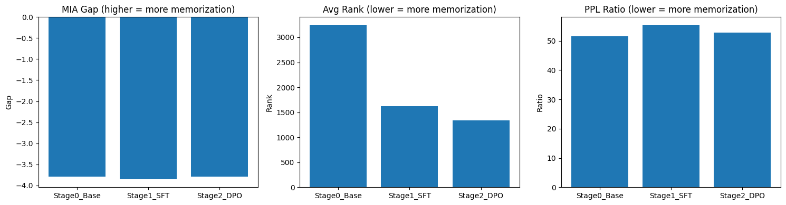

# Stage-Attributable Privacy Auditing Across Post-Training LLM Pipelines

This repository presents a **stage-attributable privacy auditing pipeline** for large language models (LLMs), focusing on how different post-training stages (SFT, DPO) affect memorization and extractability of sensitive data.

Rather than treating privacy risk as a property of the final model checkpoint, this project explicitly **attributes privacy signals to individual training stages**, and evaluates the robustness of common auditing metrics under prompt perturbations.

## Motivation

Modern LLMs typically undergo multiple post-training stages after pretraining, such as:
- **Supervised Fine-Tuning (SFT)**
- **Preference Optimization (e.g. DPO)**

However, privacy risk is often evaluated only at the final model, without understanding:
- Where memorization is introduced
- Which training objectives amplify or suppress it
- Whether common audit metrics remain reliable across stages

This project aims to answer:

> **How does privacy risk evolve across post-training stages, and how reliable are common audit signals under realistic prompt variations?**

## Key Contributions

1. **Stage-attributable privacy auditing** across Base → SFT → DPO, without introducing new sensitive data after SFT.
2. **Empirical evidence** that SFT introduces the dominant memorization jump, while DPO redistributes rather than removes memorized content.
3. **Metric validity analysis** showing that log-probability–based signals are highly prompt-sensitive, while rank- and perplexity-based signals are comparatively more robust.
4. **An end-to-end, reproducible audit pipeline**, suitable for integration into post-training safety or privacy reviews.

## Method Overview

### Training Stages

All experiments use the same model architecture (Qwen2.5-0.5B-Instruct) and base data distribution.

| Stage | Description |
|-------|-------------|
| Stage 0 – Base | Original pretrained/instruction model |
| Stage 1 – SFT | Supervised fine-tuning on a dataset containing sparse canary insertions |
| Stage 2 – DPO | Preference optimization on SFT checkpoint (no new canaries introduced) |

This design ensures that changes in privacy signals can be **causally attributed to training objectives**, not data changes.

### Canary Design

- Canary sequences are **synthetic, unique, and non-semantic**
- Inserted sparsely into the SFT training corpus
- **Not re-introduced during DPO**

The goal is to measure extractability and memorization behavior, not real-world PII leakage.

### Privacy Audit Signals

The audit evaluates multiple complementary signals:

| Signal | Description |
|--------|-------------|
| Log-Probability (Last-Token) | Measures model confidence on canary continuation |
| Rank / Exposure-style Signal | Measures how highly the canary token ranks in the predictive distribution |
| Perplexity-based Membership Proxy | Lower perplexity indicates stronger memorization |

All metrics are computed consistently across stages.

### Prompt Stress Testing

To assess robustness, each canary is evaluated under multiple prompt variants:
- Plain canary
- Instruction-wrapped prompt
- Suffix / formatting perturbations
- Optional contextual prefixes

This stress test reveals whether audit conclusions are stable or prompt-dependent.

## Results Summary

### Stage Attribution

Aggregated results show clear stage-wise privacy signal evolution:

| Stage | MIA Gap | Avg LogProb | Avg Rank | Canary PPL | PPL Ratio |
|-------|---------|-------------|----------|------------|-----------|
| Stage 0 (Base) | -3.79 | -6.55 | 3244.4 | 857.9 | 51.6 |
| Stage 1 (SFT) | -3.85 | -6.33 | 1621.1 | 690.1 | 55.4 |
| Stage 2 (DPO) | -3.79 | -6.30 | 1340.6 | 674.8 | 52.8 |



**Key Findings:**

**SFT introduces the largest increase in memorization signals:**
- Rank drops from 3244 → 1621 (50% reduction, indicating stronger memorization)
- Perplexity drops from 858 → 690 (model becomes more "familiar" with canaries)

**DPO does not eliminate memorization:**
- Rank continues to drop: 1621 → 1341
- Signals persist and are slightly reweighted
- No evidence of automatic privacy "washing"

### Metric Robustness

Stress testing reveals:
- **Rank-based signals** are the most robust across prompt perturbations
- **Log-probability signals** are highly sensitive to prompt structure
- Single-prompt, single-metric audits can be misleading

These findings highlight the importance of **stage-aware and stress-tested privacy auditing**.

## Repository Structure

```
.
├── data/
│   ├── canary_output.txt              # Canary definitions
│   ├── preference_data.jsonl          # DPO preference data
│   └── wiki_trimmed_with_canary.jsonl # Training corpus with canaries
├── models/
│   ├── Qwen2.5-0.5B-Instruct/         # Base model (Stage 0)
│   ├── stage1_sft/                    # SFT model checkpoint (Stage 1)
│   └── stage2_dpo/                    # DPO model checkpoint (Stage 2)
├── notebooks/
│   ├── 01_sft_training.ipynb          # Supervised fine-tuning (Stage 1)
│   ├── 02_dpo_training.ipynb          # Preference optimization (Stage 2)
│   └── 05_privacy_audit.ipynb         # Multi-signal privacy audit
├── src/
│   ├── canary.py                      # Canary generation
│   ├── prepare_data.py                # Data preparation
│   ├── prepare_preference_data.py     # DPO preference data generation
│   ├── train_sft.py                   # SFT training script
│   ├── train_dpo.py                   # DPO training script
│   └── audit/                         # Audit modules
│       ├── mia.py                     # Membership Inference Attack
│       ├── extraction.py              # Canary extraction tests
│       ├── internal_signals.py        # Perplexity/entropy analysis
│       └── stress_test.py             # Prompt robustness testing
├── reports/
│   ├── privacy_audit_results.csv      # Detailed audit results
│   └── stress_test_results.csv        # Stress test results
├── assets/
│   └── privacy_audit_results.png      # Results visualization
├── doc/
│   └── PROJECT_PLAN.md                # Project planning document
├── requirements.txt                   # Python dependencies
└── README.md
```

## Quick Start

### Installation

```bash
pip install -r requirements.txt
```

### Run Privacy Audit

```bash
# Option 1: Run notebook locally (requires sufficient RAM)
jupyter notebook notebooks/05_privacy_audit.ipynb

# Option 2: Run on Google Colab (recommended for GPU)
# Upload notebooks/05_privacy_audit.ipynb to Colab
```

## Reproducibility Notes

- Experiments are designed to run on consumer hardware (e.g. Apple Silicon) or Google Colab using **parameter-efficient fine-tuning (LoRA)**.
- Exact numeric results may vary with random seeds, but **qualitative trends are stable**.
- All stages use identical audit code paths to ensure comparability.

## Limitations & Threat Model

- Canary-based auditing measures **extractability**, not real-world PII exposure.
- Results are demonstrated on small-scale models; trends may differ at larger scales.
- Black-box auditing remains sensitive to prompt choice, even with stress testing.

## Why This Matters

This project suggests that:

1. **Privacy auditing should be stage-aware**, not checkpoint-only
2. **Preference optimization should not be assumed to reduce memorization** by default
3. **Audit metrics must be stress-tested** to avoid false conclusions

These insights are directly relevant to **post-training safety and privacy reviews** for frontier language models.

## License

MIT License

## Contact

This repository was developed as a research-oriented engineering project focused on privacy and safety in LLM training pipelines.
