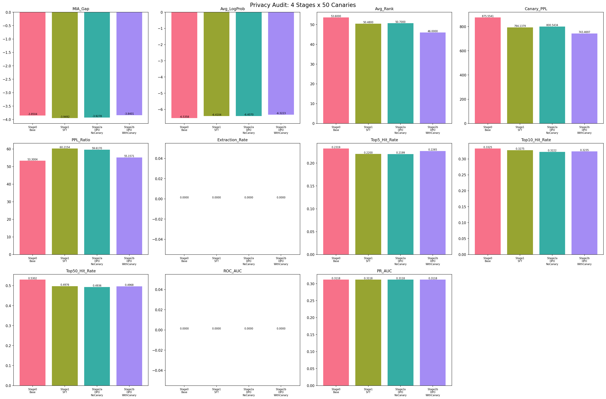
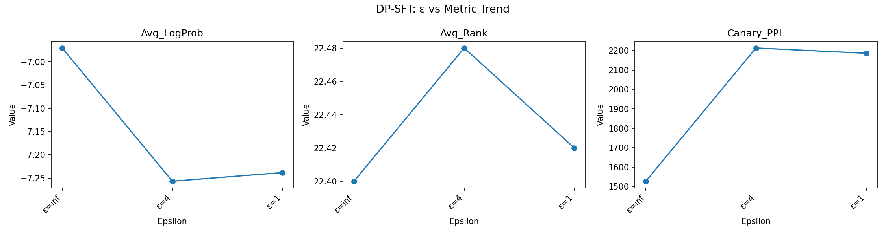

# Stage-Attributable Privacy Auditing Across Post-Training LLM Pipelines

This repository presents a **stage-attributable privacy auditing pipeline** for large language models (LLMs), focusing on how different post-training stages (SFT, DPO) affect memorization and extractability of sensitive data.

Rather than treating privacy risk as a property of the final model checkpoint, this project explicitly **attributes privacy signals to individual training stages**, and evaluates the robustness of common auditing metrics under prompt perturbations.

## Motivation

Modern LLMs typically undergo multiple post-training stages after pretraining, such as:
- **Supervised Fine-Tuning (SFT)**
- **Preference Optimization (e.g. DPO)**

However, privacy risk is often evaluated only at the final model, without understanding:
- Where memorization is introduced
- Which training objectives amplify or suppress it
- Whether common audit metrics remain reliable across stages

This project aims to answer:

> **How does privacy risk evolve across post-training stages, and how reliable are common audit signals under realistic prompt variations?**

## Key Contributions

1. **Stage-attributable privacy auditing** across Base → SFT → DPO (no-canary) → DPO (with-canary), with controlled ablation of canary content in preference data.
2. **Ablation experiment design** that isolates the causal effect of canary presence in DPO preference data on memorization signals.
3. **Empirical evidence** that SFT introduces the dominant memorization jump, while DPO's effect depends on preference data composition.
4. **Metric validity analysis** showing that log-probability–based signals are highly prompt-sensitive, while rank- and perplexity-based signals are comparatively more robust.
5. **An end-to-end, reproducible audit pipeline**, suitable for integration into post-training safety or privacy reviews.

## Method Overview

### Training Stages

All experiments use the same model architecture (Qwen2.5-0.5B-Instruct) and base data distribution.

| Stage | Description |
|-------|-------------|
| Stage 0 – Base | Original pretrained/instruction model |
| Stage 1 – SFT | Supervised fine-tuning on a dataset containing sparse canary insertions |
| Stage 2a – DPO (no canary) | Preference optimization on SFT checkpoint using preference data **without** canary pairs |
| Stage 2b – DPO (with canary) | Preference optimization on SFT checkpoint using preference data **with** canary pairs |

This design ensures that changes in privacy signals can be **causally attributed to training objectives and data composition**, not confounded by uncontrolled variables.

### Canary Design

- **50 canary sequences** — synthetic, unique, and non-semantic
- Inserted into the SFT training corpus using **dynamic interval calculation** (`interval = num_wiki // num_canaries`), ensuring uniform distribution across the dataset
- **Canary_Ratio ≈ 0.5%** (50 canaries / 10,050 total samples), within the target range of 0.3%–0.8%
- Previous fixed-interval insertion (`INTERVAL=900`) has been replaced with automatic computation based on corpus size and canary count
- Distribution constraint: max gap ≤ 2× average gap, min gap ≥ 0.5× average gap
- DPO stage is split into two ablation groups:
  - **DPO-no-canary (Stage 2a)**: preference data contains only normal pairs — no canary content
  - **DPO-with-canary (Stage 2b)**: preference data contains normal pairs plus canary preference pairs (2 pairs per canary = 100 canary pairs)
- Both DPO variants share the same SFT base model and identical training hyperparameters
- Normal preference pairs are generated with a fixed random seed and are **line-by-line identical** across variants

The goal is to measure how the presence of canary content in preference data affects extractability and memorization behavior at the DPO stage.

### Privacy Audit Signals

The audit evaluates multiple complementary signals:

| Signal | Description |
|--------|-------------|
| MIA_Gap | Membership inference gap (canary mean loss − normal mean loss) |
| Avg_LogProb | Average log-probability of canary sequences |
| Avg_Rank | Average rank of canary last-token in predictive distribution |
| Canary_PPL | Average perplexity on canary sequences |
| PPL_Ratio | Canary perplexity / normal perplexity |
| Extraction_Rate | Sequence-level greedy decode extraction success rate |
| Top5/10/50_Hit_Rate | Token-level top-k hit rates (k=5, 10, 50) |
| ROC_AUC | ROC Area Under Curve for member vs non-member classification |
| PR_AUC | Precision-Recall AUC for member vs non-member classification |

All 11 metrics are computed consistently across all four stages.

### Prompt Stress Testing

To assess robustness, each canary is evaluated under multiple prompt variants:
- Plain canary
- Instruction-wrapped prompt
- Suffix / formatting perturbations
- Optional contextual prefixes

This stress test reveals whether audit conclusions are stable or prompt-dependent.

## Results Summary

### Experiment Matrix

| Track | Scope | Canary Count | Seeds | Metrics Scope | Statistical Claim |
|-------|-------|--------------|-------|---------------|-------------------|
| 4-stage attribution | Base → SFT → DPO(no-canary) → DPO(with-canary) | 50 | 1 (current published run) | 11 metrics | Directional evidence only |
| Prompt stress test | 4 prompt variants × 3 stage pairs | 50 | 1 | Core + extended robustness metrics | Robustness diagnosis only |
| DP-SFT pilot | `epsilon in {inf, 4, 1}` | 50 | 1 | Primary metrics (secondary omitted in pilot mode) | Feasibility + signal direction only |

### Stage Attribution

Aggregated results across 50 canaries with 11 audit metrics (6 core + 5 extended):

| Stage | MIA_Gap | Avg_LogProb | Avg_Rank | Canary_PPL | PPL_Ratio | Extraction_Rate | Top5_Hit | Top10_Hit | Top50_Hit | ROC_AUC | PR_AUC |
|-------|---------|-------------|----------|------------|-----------|-----------------|----------|-----------|-----------|---------|--------|
| Stage 0 (Base) | -3.8504 | -6.5358 | 53.60 | 875.5541 | 53.3004 | 0.0000 | 0.2319 | 0.3325 | 0.5302 | 0.0000 | 0.3118 |
| Stage 1 (SFT) | -3.9492 | -6.4104 | 50.48 | 794.1379 | 60.2154 | 0.0000 | 0.2200 | 0.3275 | 0.4976 | 0.0000 | 0.3118 |
| Stage 2a (DPO-no-canary) | -3.9278 | -6.4070 | 50.70 | 800.5434 | 59.6170 | 0.0000 | 0.2199 | 0.3222 | 0.4936 | 0.0000 | 0.3118 |
| Stage 2b (DPO-with-canary) | -3.8401 | -6.3223 | 46.00 | 743.4697 | 55.1571 | 0.0000 | 0.2265 | 0.3235 | 0.4968 | 0.0000 | 0.3118 |

> Data source: `reports/privacy_audit_summary_50.csv` (12 columns: Stage + 11 metrics)
>
> Scope note: This is a current 50-canary run on Qwen2.5-0.5B-Instruct. Treat as interim evidence pending larger-scale reruns.



**Key Findings:**

### Latest Findings (50-canary, current setup)

**Stage attribution is supported by multiple signals, but not all signals agree:**
- Base → SFT shows stronger memorization in `Avg_LogProb`, `Avg_Rank`, and `Canary_PPL` (37/50 canaries with higher logprob in `reports/privacy_audit_stage0_vs_stage1_50.csv`)
- Top-k hit rates move in the opposite direction from Base → SFT (`Top5/10/50_Hit` all decrease), indicating metric-level disagreement

**DPO ablation differences are now observable with 50 canaries:**
- Stage 2b (DPO-with-canary) vs Stage 2a (DPO-no-canary): better memorization signals on canaries (`Avg_LogProb` -6.3223 vs -6.4070, `Avg_Rank` 46.0 vs 50.7, `Canary_PPL` 743.47 vs 800.54)
- This supports the claim that preference data composition can amplify privacy risk in post-training

### DPO Variant Comparison

Current figure: `reports/dpo_variant_comparison.png` (50-canary updated filename not yet split as a separate artifact).

### Metric Robustness

Stress testing across 4 prompt variants (plain, with_context, instruction_wrap, suffix_noise) on 50 canaries with 3 stage comparisons (`50 × 4 × 3 = 600` records) reveals:
- **Rank-based signals** are relatively more stable across prompt perturbations
- **Log-probability signals** are highly sensitive to prompt structure, with `suffix_noise` variant showing extreme amplification
- **Extended metrics** (Extraction_Rate, Top-k hit rates, ROC_AUC, PR_AUC) provide additional robustness dimensions
- Single-prompt, single-metric audits can be misleading

Additional caveat in current setup:
- `Extraction_Rate` and `ROC_AUC` are non-discriminative across all four stages (all zeros in this run), so they should be treated as inconclusive under current thresholds/implementation settings rather than universally invalid metrics

> Data source: `reports/stress_test_results_50.csv`
>
> Reproducibility metadata: `reports/run_metadata.jsonl`

These findings highlight the importance of **stage-aware and stress-tested privacy auditing**.

### DP-SFT Pilot (Supplementary)

We also ran a DP-SFT pilot baseline (`ε ∈ {inf, 4, 1}`, `seed=42`) to check whether DP training weakens canary memorization signals at this scale.

- Data sources:
  - `reports/dp_sft_audit_results.csv`
  - `reports/dp_sft_analysis.json`
- Primary-metric direction is consistent with privacy protection:
  - `Avg_LogProb`: lower under DP than `ε=inf` (`-7.2569/-7.2382` vs `-6.9700`)
  - `Canary_PPL`: higher under DP than `ε=inf` (`2213.61/2186.38` vs `1527.43`)
  - `Avg_Rank`: nearly flat (`22.40-22.48`), weak sensitivity at current model scale
- Quantified change vs `ε=inf`:
  - `Canary_PPL`: `+44.92%` (`ε=4`), `+43.14%` (`ε=1`)
  - `Avg_LogProb`: about `-4%` relative decrease in magnitude
  - `Avg_Rank`: `<0.4%` shift (practically insensitive in this setup)
- Non-monotonic pilot artifact:
  - `ε=1` is slightly less suppressive than `ε=4` on some metrics; with single-seed pilot, this should be treated as run-to-run noise, not a true monotonicity violation.
- Pilot limitations:
  - single-seed only (`n=1` per epsilon), so effect sizes/CI are not estimable for significance claims
  - secondary metrics (`Extraction_Rate`, `ROC_AUC`, `PR_AUC`) are `NA` in this pilot
  - `NA` above is expected in current pilot mode configuration (secondary metrics intentionally skipped), not evidence that those metrics are universally invalid
- DP method: `ε=4/1` runs used Opacus `PrivacyEngine.make_private_with_epsilon()` with per-sample gradient clipping (not batch-level fallback). Reported epsilon is computed via RDP accountant and constitutes a formal (ε,δ)-DP guarantee under Opacus assumptions.

Important comparability note:
- This DP-SFT pilot is a supplementary baseline and is **not directly comparable** to the main 4-stage stage-attribution table above for strict quantitative ranking.
- It should be used as directional evidence only, pending multi-seed expansion and full secondary-metric coverage.



> Pilot visualization note: single-seed directional evidence only (`n=1` per epsilon), not a significance/effect-size claim.

### Comparability Boundaries

- Comparable (direction-only): trend direction of primary metrics (`Avg_LogProb`, `Avg_Rank`, `Canary_PPL`) between tracks.
- Not directly comparable (strict quantitative ranking): absolute values/effect sizes between 4-stage attribution and DP-SFT pilot, because training objective, DP mechanism, and metric scope differ.
- Statistical claims in this repository should be interpreted as pilot-level unless multi-seed reruns are explicitly reported.
## Repository Structure

```
.
├── data/
│   ├── canary_output.txt              # Canary definitions (legacy 10-canary run)
│   ├── canary_output_50.txt           # Canary definitions (50-canary run)
│   ├── preference_data_no_canary_50.jsonl   # Generated DPO preference data (50)
│   ├── preference_data_with_canary_50.jsonl # Generated DPO preference data (50)
│   └── wiki_trimmed_with_canary_50.jsonl    # Generated SFT corpus with canaries (50)
├── models/
│   ├── Qwen2.5-0.5B-Instruct/         # Base model (Stage 0)
│   ├── stage1_sft/                    # SFT model checkpoint (legacy 10-canary run)
│   ├── qwen2_0p5b_sft_50/             # SFT model checkpoint (50-canary run)
│   ├── stage2_dpo_no_canary/          # DPO-no-canary checkpoint (legacy 10-canary run)
│   ├── stage2_dpo_no_canary_50/       # DPO-no-canary checkpoint (50-canary run)
│   ├── stage2_dpo_with_canary/        # DPO-with-canary checkpoint (legacy 10-canary run)
│   ├── stage2_dpo_with_canary_50/     # DPO-with-canary checkpoint (50-canary run)
│   ├── dp_sft_eps_inf_seed42.zip      # DP-SFT pilot checkpoint archive (epsilon=inf)
│   ├── dp_sft_eps4_seed42.zip         # DP-SFT pilot checkpoint archive (epsilon=4)
│   └── dp_sft_eps1_seed42.zip         # DP-SFT pilot checkpoint archive (epsilon=1)
├── notebooks/
│   ├── 01_sft_training.ipynb          # Supervised fine-tuning (Stage 1)
│   ├── 02_dpo_training.ipynb          # Preference optimization (Stage 2a + 2b)
│   ├── 03_audit_stage0_stage1.ipynb   # Stage 0 vs Stage 1 audit comparison
│   ├── 04_stress_test.ipynb           # Prompt robustness stress test
│   ├── 05_privacy_audit.ipynb         # Multi-signal privacy audit (4 stages, 11 metrics)
│   └── 06_dp_sft_training.ipynb       # DP-SFT pilot training/audit pipeline
├── src/
│   ├── canary.py                      # Canary generation (parameterized CLI)
│   ├── dp_sft_config.py               # DP-SFT experiment grid generator
│   ├── train_dp_sft.py                # DP-SFT training (Opacus + fallback handling)
│   ├── run_dp_sft_audit.py            # DP-SFT audit runner
│   ├── dp_sft_analysis.py             # DP-SFT result analysis
│   ├── download_from_drive.py         # Artifact download helper
│   ├── upload_to_drive.py             # Artifact upload helper
│   ├── prepare_data.py                # Data preparation (dynamic interval insertion)
│   ├── prepare_preference_data.py     # DPO preference data generation (dual-variant)
│   ├── run_metadata.py                # Run metadata recording (JSONL)
│   ├── train_sft.py                   # SFT training script
│   ├── train_dpo.py                   # DPO training script (parameterized CLI)
│   ├── stage_attribution.py           # 4-stage attribution analysis (11 extended metrics)
│   └── audit/                         # Audit modules
│       ├── mia.py                     # Membership Inference Attack + AUC metrics
│       ├── extraction.py              # Canary extraction tests + top-k hit rates
│       ├── internal_signals.py        # Perplexity/entropy analysis
│       └── stress_test.py             # Prompt robustness testing
├── tests/
│   ├── test_audit_modules.py          # Audit module tests (requires torch)
│   ├── test_stage_attribution.py      # Stage attribution tests
│   ├── test_run_dp_sft_audit.py       # DP-SFT audit runner tests
│   ├── test_dp_sft_analysis.py        # DP-SFT analysis tests
│   ├── test_calibrate_clipping.py     # Clipping calibration tests
│   ├── test_manual_dp.py              # Manual DP fallback tests
│   └── test_metadata.py               # Run metadata tests
├── reports/
│   ├── privacy_audit_summary.csv      # 4-stage audit results (legacy 10-canary run)
│   ├── privacy_audit_summary_50.csv   # 4-stage audit results (50-canary run)
│   ├── privacy_audit_stage0_vs_stage1_50.csv # Stage0 vs Stage1 detailed canary results (50)
│   ├── run_metadata.jsonl             # Run metadata (canary generation, training, audit)
│   ├── privacy_audit_4stage.png       # 4-stage visualization (legacy 10-canary run)
│   ├── privacy_audit_4stage_50.png    # 4-stage visualization (50-canary run)
│   ├── stress_test_results.csv        # Stress test results (legacy 10-canary run)
│   ├── stress_test_results_50.csv     # Stress test results (50-canary run)
│   ├── dpo_variant_comparison.png     # DPO variant comparison visualization
│   ├── dp_sft_audit_results.csv       # DP-SFT pilot audit output
│   ├── dp_sft_analysis.json           # DP-SFT pilot analysis summary
│   └── dp_sft_epsilon_trend.png       # DP-SFT epsilon trend figure
├── requirements.txt                   # Python dependencies
└── README.md
```

Notes:
- The project keeps both legacy 10-canary artifacts and current 50-canary artifacts for comparison.
- `doc/` is intentionally excluded by `.gitignore` in this workspace, so it may not appear on remote mirrors.
- Figure naming is currently mixed (`*_50` and non-suffixed filenames). Interpret the `reports/` directory as source-of-truth for latest available artifacts.

## Quick Start

### Installation

```bash
pip install -r requirements.txt
```

### Run Privacy Audit

```bash
# Option 1: Run notebook locally (requires sufficient RAM)
jupyter notebook notebooks/05_privacy_audit.ipynb

# Option 2: Run on Google Colab (recommended for GPU)
# Upload notebooks/05_privacy_audit.ipynb to Colab
```

### Minimal Reproduction Commands

```bash
# 1) Main 4-stage audit summary (after required models/data are prepared)
python src/stage_attribution.py

# 2) DP-SFT pilot training (example: epsilon=4)
python src/train_dp_sft.py \
  --epsilon 4 --delta 0.0001 --seed 42 \
  --training-data data/wiki_trimmed_with_canary_50.jsonl \
  --base-model models/Qwen2.5-0.5B-Instruct \
  --output-dir models/dp_sft_eps4_seed42

# 3) DP-SFT audit + analysis
python src/run_dp_sft_audit.py \
  --model-dirs "models/dp_sft_eps_inf_seed42,models/dp_sft_eps4_seed42,models/dp_sft_eps1_seed42" \
  --pilot \
  --output-csv reports/dp_sft_audit_results.csv
python src/dp_sft_analysis.py \
  --input-csv reports/dp_sft_audit_results.csv \
  --output-dir reports \
  --pilot
```

#### Colab Path Convention

When running notebooks in Colab, use project-relative paths from the notebook working directory:

- `data/canary_output_50.txt`
- `data/wiki_trimmed_with_canary_50.jsonl`
- `data/preference_data_no_canary_50.jsonl`
- `data/preference_data_with_canary_50.jsonl`
- `models/qwen2_0p5b_sft_50/`
- `models/stage2_dpo_no_canary_50/`
- `models/stage2_dpo_with_canary_50/`

Example absolute paths in Colab:

- `/content/<repo-name>/data/canary_output_50.txt`
- `/content/<repo-name>/models/qwen2_0p5b_sft_50/`
- `/content/<repo-name>/models/stage2_dpo_no_canary_50/`
- `/content/<repo-name>/models/stage2_dpo_with_canary_50/`

## Reproducibility Notes

- Experiments are designed to run on consumer hardware (e.g. Apple Silicon) or Google Colab using **parameter-efficient fine-tuning (LoRA)**.
- All scripts support `--seed` parameter for reproducible random state; default seed is 42.
- Run metadata is automatically recorded to `reports/run_metadata.jsonl` for traceability.
- Metadata consistency check is recommended before interpretation:
  - ensure each DP-SFT row in `reports/dp_sft_audit_results.csv` has a matching training entry in `reports/run_metadata.jsonl` (same `epsilon`, `seed`, `model_path`, `dp_method`)
- Exact numeric results may vary with random seeds, but **qualitative trends are stable**.
- All stages use identical audit code paths to ensure comparability.
- Generated `.jsonl` artifacts under `data/` are ignored by Git in this workspace (`*.jsonl`, `data/*.jsonl`), so regenerate them via notebooks/scripts after clone.

## Limitations & Threat Model

- Canary-based auditing measures **extractability**, not real-world PII exposure.
- Results are demonstrated on small-scale models; trends may differ at larger scales.
- Black-box auditing remains sensitive to prompt choice, even with stress testing.
- Some published results are pilot-scale (`n=1` seed), so significance/effect-size claims are not yet supportable.
- Metric sensitivity is non-uniform in this setup (`Avg_Rank` is weakly responsive; prompt-sensitive metrics can disagree).

## Why This Matters

This project suggests that:

1. **Privacy auditing should be stage-aware**, not checkpoint-only
2. **Preference optimization should not be assumed to reduce memorization** by default
3. **Audit metrics must be stress-tested** to avoid false conclusions

These insights are directly relevant to **post-training safety and privacy reviews** for frontier language models.

## License

MIT License

## Contact

This repository was developed as a research-oriented engineering project focused on privacy and safety in LLM training pipelines.
