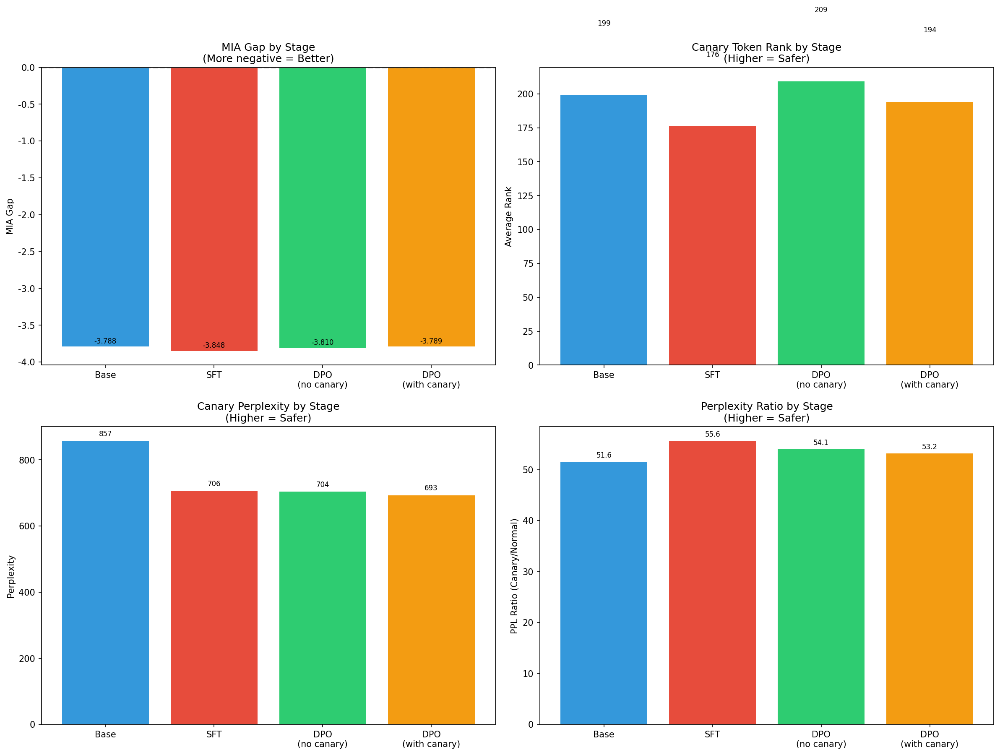
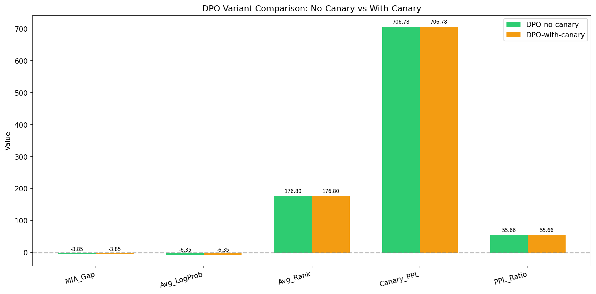

# Stage-Attributable Privacy Auditing Across Post-Training LLM Pipelines

This repository presents a **stage-attributable privacy auditing pipeline** for large language models (LLMs), focusing on how different post-training stages (SFT, DPO) affect memorization and extractability of sensitive data.

Rather than treating privacy risk as a property of the final model checkpoint, this project explicitly **attributes privacy signals to individual training stages**, and evaluates the robustness of common auditing metrics under prompt perturbations.

## Motivation

Modern LLMs typically undergo multiple post-training stages after pretraining, such as:
- **Supervised Fine-Tuning (SFT)**
- **Preference Optimization (e.g. DPO)**

However, privacy risk is often evaluated only at the final model, without understanding:
- Where memorization is introduced
- Which training objectives amplify or suppress it
- Whether common audit metrics remain reliable across stages

This project aims to answer:

> **How does privacy risk evolve across post-training stages, and how reliable are common audit signals under realistic prompt variations?**

## Key Contributions

1. **Stage-attributable privacy auditing** across Base → SFT → DPO (no-canary) → DPO (with-canary), with controlled ablation of canary content in preference data.
2. **Ablation experiment design** that isolates the causal effect of canary presence in DPO preference data on memorization signals.
3. **Empirical evidence** that SFT introduces the dominant memorization jump, while DPO's effect depends on preference data composition.
4. **Metric validity analysis** showing that log-probability–based signals are highly prompt-sensitive, while rank- and perplexity-based signals are comparatively more robust.
5. **An end-to-end, reproducible audit pipeline**, suitable for integration into post-training safety or privacy reviews.

## Method Overview

### Training Stages

All experiments use the same model architecture (Qwen2.5-0.5B-Instruct) and base data distribution.

| Stage | Description |
|-------|-------------|
| Stage 0 – Base | Original pretrained/instruction model |
| Stage 1 – SFT | Supervised fine-tuning on a dataset containing sparse canary insertions |
| Stage 2a – DPO (no canary) | Preference optimization on SFT checkpoint using preference data **without** canary pairs |
| Stage 2b – DPO (with canary) | Preference optimization on SFT checkpoint using preference data **with** canary pairs |

This design ensures that changes in privacy signals can be **causally attributed to training objectives and data composition**, not confounded by uncontrolled variables.

### Canary Design

- **50 canary sequences** — synthetic, unique, and non-semantic
- Inserted into the SFT training corpus using **dynamic interval calculation** (`interval = num_wiki // num_canaries`), ensuring uniform distribution across the dataset
- **Canary_Ratio ≈ 0.5%** (50 canaries / 10,050 total samples), within the target range of 0.3%–0.8%
- Previous fixed-interval insertion (`INTERVAL=900`) has been replaced with automatic computation based on corpus size and canary count
- Distribution constraint: max gap ≤ 2× average gap, min gap ≥ 0.5× average gap
- DPO stage is split into two ablation groups:
  - **DPO-no-canary (Stage 2a)**: preference data contains only normal pairs — no canary content
  - **DPO-with-canary (Stage 2b)**: preference data contains normal pairs plus canary preference pairs (2 pairs per canary = 100 canary pairs)
- Both DPO variants share the same SFT base model and identical training hyperparameters
- Normal preference pairs are generated with a fixed random seed and are **line-by-line identical** across variants

The goal is to measure how the presence of canary content in preference data affects extractability and memorization behavior at the DPO stage.

### Privacy Audit Signals

The audit evaluates multiple complementary signals:

| Signal | Description |
|--------|-------------|
| MIA_Gap | Membership inference gap (canary mean loss − normal mean loss) |
| Avg_LogProb | Average log-probability of canary sequences |
| Avg_Rank | Average rank of canary last-token in predictive distribution |
| Canary_PPL | Average perplexity on canary sequences |
| PPL_Ratio | Canary perplexity / normal perplexity |
| Extraction_Rate | Sequence-level greedy decode extraction success rate |
| Top5/10/50_Hit_Rate | Token-level top-k hit rates (k=5, 10, 50) |
| ROC_AUC | ROC Area Under Curve for member vs non-member classification |
| PR_AUC | Precision-Recall AUC for member vs non-member classification |

All 11 metrics are computed consistently across all four stages.

### Prompt Stress Testing

To assess robustness, each canary is evaluated under multiple prompt variants:
- Plain canary
- Instruction-wrapped prompt
- Suffix / formatting perturbations
- Optional contextual prefixes

This stress test reveals whether audit conclusions are stable or prompt-dependent.

## Results Summary

### Stage Attribution

Aggregated results across 50 canaries with 11 audit metrics (6 core + 5 extended):

| Stage | MIA_Gap | Avg_LogProb | Avg_Rank | Canary_PPL | PPL_Ratio | Extraction_Rate | Top5_Hit | Top10_Hit | Top50_Hit | ROC_AUC | PR_AUC |
|-------|---------|-------------|----------|------------|-----------|-----------------|----------|-----------|-----------|---------|--------|
| Stage 0 (Base) | — | — | — | — | — | — | — | — | — | — | — |
| Stage 1 (SFT) | — | — | — | — | — | — | — | — | — | — | — |
| Stage 2a (DPO-no-canary) | — | — | — | — | — | — | — | — | — | — | — |
| Stage 2b (DPO-with-canary) | — | — | — | — | — | — | — | — | — | — | — |

> Data source: `reports/privacy_audit_summary.csv` (12 columns: Stage + 11 metrics)
> 
> Note: Results will be populated after re-running the full audit pipeline with 50 canaries on GPU. Previous 10-canary results are archived in `doc/Research_Report_2026-02-10.md`.



**Key Findings:**

> Note: The findings below are based on the original 10-canary experiment. Results with 50 canaries and extended metrics will be populated after re-running the full pipeline on GPU. Previous 10-canary results are archived in `doc/Research_Report_2026-02-10.md`.

**SFT introduces the dominant memorization signal shift (10-canary baseline):**
- Avg Rank drops from 199.9 → 176.8 (-11.6%, indicating stronger memorization)
- Canary PPL drops from 857.9 → 706.8 (-17.6%, model becomes more "familiar" with canaries)
- PPL Ratio increases from 51.6 → 55.7 (+7.9%)

**DPO ablation result (10-canary baseline):**
- Stage 2a (DPO-no-canary) and Stage 2b (DPO-with-canary) showed identical values to Stage 1 (SFT) in the 10-canary experiment, indicating no measurable additional memorization effects
- The 50-canary scale-up with extended metrics (Extraction_Rate, Top-k hit rates, ROC_AUC, PR_AUC) is expected to provide higher statistical power for detecting DPO-stage differences

### DPO Variant Comparison



### Metric Robustness

Stress testing across 4 prompt variants (plain, with_context, instruction_wrap, suffix_noise) on 50 canaries (200 samples total) with 11 extended metrics reveals:
- **Rank-based signals** are relatively more stable across prompt perturbations
- **Log-probability signals** are highly sensitive to prompt structure, with `suffix_noise` variant showing extreme amplification
- **Extended metrics** (Extraction_Rate, Top-k hit rates, ROC_AUC, PR_AUC) provide additional robustness dimensions
- Single-prompt, single-metric audits can be misleading

> Note: Quantitative stress test breakdowns will be updated after re-running with 50 canaries on GPU. Previous 10-canary stress test results (40 samples): rank direction 19/9/12 improved/worsened/unchanged, logprob direction 24/16 positive/negative.

> Data source: `reports/stress_test_results.csv`

These findings highlight the importance of **stage-aware and stress-tested privacy auditing**.

## Repository Structure

```
.
├── data/
│   ├── canary_output.txt              # Canary definitions
│   ├── preference_data_no_canary.jsonl # DPO preference data without canary pairs
│   ├── preference_data_with_canary.jsonl # DPO preference data with canary pairs
│   └── wiki_trimmed_with_canary.jsonl # Training corpus with canaries
├── models/
│   ├── Qwen2.5-0.5B-Instruct/        # Base model (Stage 0)
│   ├── stage1_sft/                    # SFT model checkpoint (Stage 1)
│   ├── stage2_dpo_no_canary/          # DPO-no-canary checkpoint (Stage 2a)
│   └── stage2_dpo_with_canary/        # DPO-with-canary checkpoint (Stage 2b)
├── notebooks/
│   ├── 01_sft_training.ipynb          # Supervised fine-tuning (Stage 1)
│   ├── 02_dpo_training.ipynb          # Preference optimization (Stage 2a + 2b)
│   ├── 03_audit_stage0_stage1.ipynb   # Stage 0 vs Stage 1 audit comparison
│   ├── 04_stress_test.ipynb           # Prompt robustness stress test
│   └── 05_privacy_audit.ipynb         # Multi-signal privacy audit (4 stages, 11 metrics)
├── src/
│   ├── canary.py                      # Canary generation (parameterized CLI)
│   ├── prepare_data.py                # Data preparation (dynamic interval insertion)
│   ├── prepare_preference_data.py     # DPO preference data generation (dual-variant)
│   ├── run_metadata.py                # Run metadata recording (JSONL)
│   ├── train_sft.py                   # SFT training script
│   ├── train_dpo.py                   # DPO training script (parameterized CLI)
│   ├── stage_attribution.py           # 4-stage attribution analysis (11 extended metrics)
│   └── audit/                         # Audit modules
│       ├── mia.py                     # Membership Inference Attack + AUC metrics
│       ├── extraction.py              # Canary extraction tests + top-k hit rates
│       ├── internal_signals.py        # Perplexity/entropy analysis
│       └── stress_test.py             # Prompt robustness testing
├── tests/
│   ├── test_audit_modules.py          # Audit module tests (requires torch)
│   └── test_stage_attribution.py      # Stage attribution tests
├── reports/
│   ├── privacy_audit_summary.csv      # 4-stage audit results (12 columns: Stage + 11 metrics)
│   ├── attribution_summary.json       # Stage attribution report
│   ├── run_metadata.jsonl             # Run metadata (canary generation, training, audit)
│   ├── privacy_audit_results.png      # Results visualization
│   └── stress_test_results.csv        # Stress test results
├── doc/
│   ├── PROJECT_PLAN.md                # Project planning document
│   └── agent_sync.md                  # Multi-agent coordination log
├── requirements.txt                   # Python dependencies
└── README.md
```

## Quick Start

### Installation

```bash
pip install -r requirements.txt
```

### Run Privacy Audit

```bash
# Option 1: Run notebook locally (requires sufficient RAM)
jupyter notebook notebooks/05_privacy_audit.ipynb

# Option 2: Run on Google Colab (recommended for GPU)
# Upload notebooks/05_privacy_audit.ipynb to Colab
```

#### Colab Path Convention

When running notebooks in Colab, use the following paths:

- `data/canary_output.txt`
- `data/wiki_trimmed_with_canary.jsonl`
- `data/preference_data_no_canary.jsonl`
- `data/preference_data_with_canary.jsonl`
- `models/stage1_sft/`
- `models/stage2_dpo_no_canary/`
- `models/stage2_dpo_with_canary/`

Example full paths:

- `/data/canary_output.txt`
- `/models/stage1_sft/`
- `/models/stage2_dpo_no_canary/`
- `/models/stage2_dpo_with_canary/`

## Reproducibility Notes

- Experiments are designed to run on consumer hardware (e.g. Apple Silicon) or Google Colab using **parameter-efficient fine-tuning (LoRA)**.
- All scripts support `--seed` parameter for reproducible random state; default seed is 42.
- Run metadata is automatically recorded to `reports/run_metadata.jsonl` for traceability.
- Exact numeric results may vary with random seeds, but **qualitative trends are stable**.
- All stages use identical audit code paths to ensure comparability.

## Limitations & Threat Model

- Canary-based auditing measures **extractability**, not real-world PII exposure.
- Results are demonstrated on small-scale models; trends may differ at larger scales.
- Black-box auditing remains sensitive to prompt choice, even with stress testing.

## Why This Matters

This project suggests that:

1. **Privacy auditing should be stage-aware**, not checkpoint-only
2. **Preference optimization should not be assumed to reduce memorization** by default
3. **Audit metrics must be stress-tested** to avoid false conclusions

These insights are directly relevant to **post-training safety and privacy reviews** for frontier language models.

## License

MIT License

## Contact

This repository was developed as a research-oriented engineering project focused on privacy and safety in LLM training pipelines.
